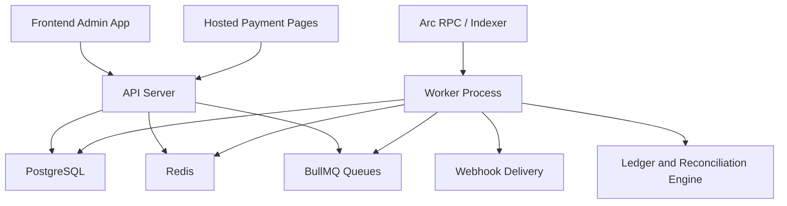
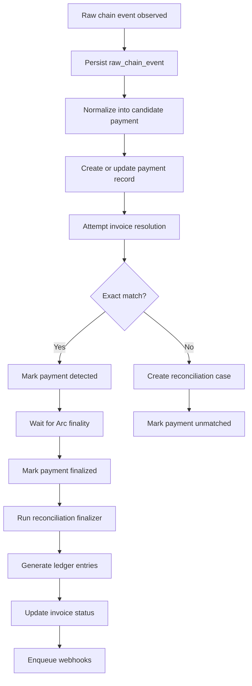

# Stablebooks Backend and API Plan

## Document status

- Version: `v0.2`
- Date: `2026-04-19`
- Product: `Stablebooks`
- Scope: `MVP backend and API implementation plan`
- Companion docs:
  - [arc_treasury_os_blueprint.md](/G:/bugbounty/Stablebooks/docs/product/arc_treasury_os_blueprint.md)
  - [arc_treasury_os_prd.md](/G:/bugbounty/Stablebooks/docs/product/arc_treasury_os_prd.md)
  - [arc_treasury_os_ia_wireframes.md](/G:/bugbounty/Stablebooks/docs/product/arc_treasury_os_ia_wireframes.md)
  - [arc_treasury_os_frontend_plan.md](/G:/bugbounty/Stablebooks/docs/product/arc_treasury_os_frontend_plan.md)
  - [arc_treasury_os_milestone_4_foundation.md](/G:/bugbounty/Stablebooks/docs/product/arc_treasury_os_milestone_4_foundation.md)
  - [arc_treasury_os_milestone_4_execution_backlog.md](/G:/bugbounty/Stablebooks/docs/product/arc_treasury_os_milestone_4_execution_backlog.md)

## Goal

This document turns the product spec into a backend and API delivery plan for a solo builder.

It defines:

- backend architecture,
- domain modules,
- database structure,
- public and authenticated API surfaces,
- payment and settlement event pipeline,
- webhook model,
- queue and job design,
- security model,
- implementation order.

The plan is optimized for:

- one-person execution,
- fast MVP delivery,
- trustworthy payment state handling,
- clear future expansion into richer treasury workflows.

## Recommended backend stack

### Core runtime

- `Node.js`
- `TypeScript`
- `NestJS` or `Fastify`

Recommended choice:

- `NestJS`

Reason:

- good module boundaries,
- opinionated structure helps solo maintenance,
- easy injection for services and adapters,
- mature support for validation, guards, schedulers, and testing.

If you prefer minimalism and speed over framework structure:

- `Fastify` is a valid alternative.

### Data and infrastructure

- `PostgreSQL`
- `Prisma`
- `Redis`
- `BullMQ`

### Chain and integrations

- Arc RPC provider
- Arc indexer or event source
- Viem or Ethers-compatible tooling for onchain reads and tx parsing
- Circle-aligned settlement integrations later

### Validation and security

- `Zod` or `class-validator`
- `jsonwebtoken` or a managed auth provider session model
- HMAC signing for webhooks

## Architecture principles

### 1. Monolith first

Start with a modular monolith.

Do not split into microservices in MVP.

Use:

- one API server,
- one worker process,
- one Postgres database,
- one Redis instance.

### 2. Event-driven inside the monolith

Even though deployment is a monolith, model payment workflows as events.

Reason:

- payment detection,
- settlement confirmation,
- reconciliation,
- exports,
- webhook delivery

should not be tightly coupled in one request lifecycle.

### 3. Arc finality is the source of truth

Important backend rule:

- `paid` means final settled on Arc,
- not just detected on a source chain,
- not just a user-submitted tx hash.

### 4. Persist first, interpret second

For chain events:

1. ingest raw event,
2. store raw record,
3. normalize it,
4. resolve business meaning,
5. emit downstream side effects.

### 5. Keep onchain logic thin

Business logic belongs offchain first:

- invoice state,
- reconciliation,
- routing logic,
- exports,
- alerts,
- webhook delivery.

## High-level system architecture



## Recommended repository structure

If backend lives in its own app:

```text
stablebooks-api/
  src/
  prisma/
  test/
  scripts/
  docs/
```

Recommended expanded structure:

```text
stablebooks-api/
  src/
    main.ts
    app.module.ts
    common/
      dto/
      enums/
      errors/
      filters/
      guards/
      interceptors/
      pipes/
      utils/
    config/
      app.config.ts
      database.config.ts
      redis.config.ts
      chain.config.ts
      webhook.config.ts
    modules/
      auth/
      users/
      organizations/
      wallets/
      customers/
      invoices/
      payments/
      reconciliation/
      treasury/
      ledger/
      exports/
      webhooks/
      public/
      health/
    jobs/
      queues/
      processors/
      schedulers/
    integrations/
      arc/
      circle/
      email/
    database/
      prisma.service.ts
      transaction.ts
    types/
  prisma/
    schema.prisma
    migrations/
    seed.ts
  test/
    integration/
    e2e/
    fixtures/
  scripts/
    seed-dev.ts
    replay-events.ts
```

## Current monorepo alignment

The current repository already uses a monorepo shape with:

- `apps/api` for the NestJS API and worker-adjacent backend code
- `apps/api/prisma` for schema and migrations
- `apps/api/src/modules` for domain modules such as `auth`, `customers`,
  `invoices`, `organizations`, `payments`, `public`, `wallets`, and `webhooks`

Milestone 4 should extend that existing structure instead of introducing a new
service split. The production-shaped payment work can stay inside `apps/api`
while keeping module boundaries explicit.

## Module boundaries

## 1. Auth module

Responsibilities:

- sign in
- sign up
- session validation
- route guards

## 2. Users module

Responsibilities:

- user profile
- user-to-organization membership
- role lookup

## 3. Organizations module

Responsibilities:

- organization creation
- onboarding state
- base settings
- default invoice and treasury preferences later

## 4. Wallets module

Responsibilities:

- register wallets
- validate wallet format
- assign wallet roles
- store chain metadata
- set default settlement wallet

## 5. Customers module

Responsibilities:

- create and update customers
- list customers
- attach metadata

## 6. Invoices module

Responsibilities:

- draft and published invoices
- invoice public token
- invoice reference generation
- invoice listing and detail
- invoice state transitions

## 7. Payments module

Responsibilities:

- payment intent records
- payment records
- raw chain event records
- public invoice payment bootstrap
- payment state transitions

## 8. Reconciliation module

Responsibilities:

- exact matching
- partial payment handling
- overpayment handling
- unmatched queue
- manual resolution actions

## 9. Treasury module

Responsibilities:

- wallet balances snapshot
- routing rules
- recent settlement history
- treasury overview endpoint

## 10. Ledger module

Responsibilities:

- normalized financial entries
- immutable audit trail
- export-ready accounting rows

## 11. Exports module

Responsibilities:

- export requests
- export generation
- export storage or temporary file handling

## 12. Webhooks module

Responsibilities:

- endpoint configuration
- signed payload delivery
- delivery logging
- retries

## 13. Public module

Responsibilities:

- hosted invoice public endpoints
- public status polling
- public payment issue states

## 14. Health module

Responsibilities:

- liveness
- readiness
- dependency health checks

## Deployment topology

## Recommended services

Start with these deployables:

1. `api`
2. `worker`
3. `postgres`
4. `redis`

Optional later:

- `scheduler` as separate process if needed
- `webhook worker` if delivery volume grows

## Why split API and worker

Because payment and webhook workloads are background-heavy:

- event ingestion,
- settlement polling,
- reconciliation,
- export generation,
- webhook retries.

Keeping these out of the API request path improves reliability.

## Database design

## Core schema entities

### users

- id
- email
- password_hash or auth_provider_id
- name
- created_at
- updated_at

### organizations

- id
- name
- billing_country
- base_currency
- onboarding_status
- created_at
- updated_at

### organization_memberships

- id
- organization_id
- user_id
- role
- created_at

### wallets

- id
- organization_id
- chain
- address
- label
- role
- is_default_settlement
- status
- created_at
- updated_at

### customers

- id
- organization_id
- name
- email
- billing_currency
- metadata_json
- created_at
- updated_at

### invoices

- id
- organization_id
- customer_id
- public_token
- external_invoice_id
- reference_code
- currency
- amount_minor
- due_at
- memo
- internal_note
- status
- published_at
- created_at
- updated_at

### invoice_payment_options

- id
- invoice_id
- token
- chain
- enabled

### payment_intents

- id
- invoice_id
- settlement_chain
- settlement_wallet_id
- status
- expires_at
- created_at
- updated_at

### raw_chain_events

- id
- chain
- event_type
- block_number
- tx_hash
- log_index
- payload_json
- observed_at
- processed_at
- processing_status

### payments

- id
- organization_id
- invoice_id nullable
- payment_intent_id nullable
- observation_id nullable
- source_chain
- source_tx_hash
- source_sender_address
- source_recipient_address
- block_number nullable
- chain_id nullable
- settlement_chain
- settlement_tx_hash
- token
- amount_atomic
- decimals nullable
- amount_minor
- currency
- detected_at
- confirmed_at nullable
- finalized_at
- status
- match_status
- raw_event_id nullable
- created_at
- updated_at

### chain_payment_observations

- id
- organization_id
- wallet_id nullable
- payment_id nullable
- chain_id
- tx_hash
- block_number
- from_address
- to_address
- token
- amount_atomic
- decimals
- observed_at
- confirmed_at nullable
- status
- created_at
- updated_at

### payment_matches

- id
- organization_id
- payment_id nullable
- invoice_id nullable
- observation_id
- match_result
- match_reason
- created_at
- updated_at

### reconciliation_cases

- id
- organization_id
- payment_id
- invoice_id nullable
- type
- status
- notes
- resolved_by nullable
- resolved_at nullable
- created_at

### treasury_rules

- id
- organization_id
- type
- config_json
- status
- created_at
- updated_at

### ledger_entries

- id
- organization_id
- invoice_id nullable
- payment_id nullable
- entry_type
- debit_account
- credit_account
- amount_minor
- currency
- effective_at
- metadata_json
- created_at

### export_jobs

- id
- organization_id
- requested_by_user_id
- export_type
- filters_json
- status
- file_path nullable
- error_message nullable
- created_at
- completed_at nullable

### webhook_endpoints

- id
- organization_id
- url
- signing_secret
- enabled
- event_types_json
- created_at
- updated_at

### webhook_deliveries

- id
- webhook_endpoint_id
- event_id
- event_type
- payload_json
- signature
- status
- attempt_count
- last_attempt_at nullable
- next_attempt_at nullable
- response_code nullable
- response_body nullable
- created_at

### audit_logs

- id
- organization_id nullable
- user_id nullable
- action
- entity_type
- entity_id
- metadata_json
- created_at

## Database rules

### Must-have constraints

- unique wallet per organization per chain/address
- unique invoice public token
- unique raw chain event per chain/tx_hash/log_index
- unique payment by normalized event identity where possible
- unique organization membership per user/org

### Must-have indexes

- invoices by organization/status
- invoices by organization/customer_id
- payments by organization/status
- payments by invoice_id
- payments by settlement_tx_hash
- chain_payment_observations by organization_id/status
- chain_payment_observations by chain_id/tx_hash
- payment_matches by observation_id
- raw_chain_events by processing_status
- webhook_deliveries by status/next_attempt_at
- export_jobs by organization/status

## Milestone 4 production payment slice

The foundation doc defines the canonical flow. This section translates that
flow into concrete backend ownership for the current `apps/api` codebase.

### Prisma and persistence work

Milestone 4 should add or extend these models in
`apps/api/prisma/schema.prisma`:

- extend `Payment` with `blockNumber`, `chainId`, `decimals`, `confirmedAt`,
  and a nullable relation to `ChainPaymentObservation`
- add `ChainPaymentObservation` as the normalized ingestion record with the
  minimum onchain fields
- add `PaymentMatch` so exact, unmatched, ambiguous, and rejected outcomes are
  durable and queryable
- keep `WebhookDelivery` as the operational delivery log and leave settlement
  truth in payment-oriented tables

### Module and service ownership

The first production-shaped implementation can stay mostly inside the existing
`payments` and `webhooks` modules.

Inside `apps/api/src/modules/payments`, add responsibilities for:

- `chain-payment-observations.repository.ts`: persistence and deduplication of
  normalized observations
- `payment-matching.service.ts`: exact-match routing by wallet, token, amount,
  and open payment candidates
- `payment-confirmation.service.ts`: `pending -> processing -> finalized|failed`
  state transitions and `confirmedAt` handling
- `payment-resolution.service.ts`: orchestration from observation ingest to
  invoice status updates and webhook enqueueing

Inside `apps/api/src/modules/webhooks`, extend responsibilities for:

- creating `payment.finalized` and `payment.failed` deliveries from payment
  state transitions
- exposing delivery status for operator visibility and replay workflows

### First internal interfaces

These paths do not need to be public product APIs, but the backend should have
clear internal contracts for them:

- `ingestArcTransfer(rawEvent) -> ChainPaymentObservation`
- `matchObservation(observationId) -> PaymentMatch`
- `confirmPayment(paymentId) -> Payment`
- `emitPaymentWebhook(paymentId, eventType) -> WebhookDelivery[]`

### First authenticated read surfaces

Milestone 4 should make these existing read APIs richer rather than inventing
many new admin endpoints:

- `GET /api/v1/invoices/:invoiceId` should include the resolved settlement
  fields and latest webhook delivery summary
- `GET /api/v1/payments/:paymentId` should expose the canonical onchain fields,
  match result, and confirmation timestamps
- `GET /api/v1/webhooks` or a deliveries-focused companion endpoint should make
  retry, dead-letter, and last response state queryable in one operator flow

## API surface overview

Split the API into:

1. authenticated admin API
2. public hosted invoice API
3. internal worker-only integration paths if needed

## API conventions

### Base prefix

- `/api/v1`

### Response shape

Recommended success shape:

```json
{
  "data": {},
  "meta": {}
}
```

Recommended error shape:

```json
{
  "error": {
    "code": "VALIDATION_ERROR",
    "message": "The provided invoice amount is invalid.",
    "details": {}
  }
}
```

### Idempotency

Support idempotency keys for:

- invoice creation if triggered externally later
- export generation
- webhook tests
- manual reconciliation actions if needed

### Pagination

Cursor-based pagination preferred for:

- invoices
- customers
- payments
- unmatched queue

MVP fallback:

- offset pagination is acceptable if implemented cleanly.

## Authenticated admin API

## Auth

### POST /api/v1/auth/signup

Purpose:

- create account

### POST /api/v1/auth/signin

Purpose:

- start authenticated session

### POST /api/v1/auth/signout

### GET /api/v1/me

Purpose:

- current user and org context

## Organizations

### POST /api/v1/organizations

Purpose:

- create organization during onboarding

Request:

- name
- billing_country
- base_currency

### GET /api/v1/organizations/current

### PATCH /api/v1/organizations/current

## Wallets

### GET /api/v1/wallets

### POST /api/v1/wallets

Request:

- chain
- address
- label
- role
- is_default_settlement

### PATCH /api/v1/wallets/:walletId

### POST /api/v1/wallets/:walletId/set-default

## Customers

### GET /api/v1/customers

Query params:

- search
- cursor or page

### POST /api/v1/customers

### GET /api/v1/customers/:customerId

### PATCH /api/v1/customers/:customerId

## Invoices

### GET /api/v1/invoices

Query params:

- status
- customer_id
- from_due_date
- to_due_date
- currency
- search

### POST /api/v1/invoices

Purpose:

- create draft or publish invoice

Request:

- customer_id
- amount_minor
- currency
- due_at
- memo
- internal_note
- accepted_payment_options
- publish boolean

Server responsibilities:

- generate reference code
- generate public token
- assign payment intent
- set status to draft or open

### GET /api/v1/invoices/:invoiceId

### PATCH /api/v1/invoices/:invoiceId

Supported updates in MVP:

- memo
- internal_note
- due_at

### POST /api/v1/invoices/:invoiceId/publish

### POST /api/v1/invoices/:invoiceId/cancel

## Dashboard

### GET /api/v1/dashboard

Response includes:

- open invoice count
- paid volume for period
- unmatched payment count
- treasury balance snapshot
- recent payments
- invoice aging summary

## Payments

### GET /api/v1/payments/:paymentId

### GET /api/v1/payments

Optional for later:

- list payments directly

## Reconciliation

### GET /api/v1/reconciliation/unmatched

Query params:

- search
- token
- chain
- status

### POST /api/v1/reconciliation/match

Request:

- payment_id
- invoice_id
- note optional

### POST /api/v1/reconciliation/ignore

Request:

- payment_id
- note optional

## Treasury

### GET /api/v1/treasury/overview

Response includes:

- balances by wallet
- balances by role
- recent settlements
- rules summary
- treasury alerts

### GET /api/v1/treasury/rules

### POST /api/v1/treasury/rules

### GET /api/v1/treasury/rules/:ruleId

### PATCH /api/v1/treasury/rules/:ruleId

### POST /api/v1/treasury/rules/:ruleId/disable

## Exports

### POST /api/v1/exports

Request:

- export_type
- filters

Response:

- export job id
- status

### GET /api/v1/exports

### GET /api/v1/exports/:exportJobId

### GET /api/v1/exports/:exportJobId/download

## Webhooks

### GET /api/v1/webhooks

### POST /api/v1/webhooks

### PATCH /api/v1/webhooks/:webhookId

### POST /api/v1/webhooks/:webhookId/test

## Team

### GET /api/v1/team/members

### POST /api/v1/team/invitations

Lightweight MVP note:

- this can be partially stubbed if you keep single-admin first.

## Public hosted invoice API

## GET /api/v1/public/invoices/:publicToken

Purpose:

- bootstrap hosted payment page

Response includes:

- business display name
- invoice id
- amount
- currency
- accepted tokens
- invoice status
- public payment instructions

## GET /api/v1/public/invoices/:publicToken/status

Purpose:

- poll payment lifecycle

Response includes:

- invoice status
- payment status
- amount received
- final settlement flag
- redirect hint if issue/success

## POST /api/v1/public/invoices/:publicToken/payment-session

Optional MVP path:

- initialize wallet-based payment flow

This can stay thin or mocked initially depending on onchain integration timing.

## Health API

### GET /api/v1/health/live

### GET /api/v1/health/ready

Readiness should check:

- Postgres
- Redis
- chain integration availability optionally degraded

## Internal event model

These are the business events that matter inside the backend:

- `organization.created`
- `wallet.added`
- `invoice.created`
- `invoice.published`
- `payment.detected`
- `payment.settling`
- `payment.processing`
- `payment.finalized`
- `payment.failed`
- `payment.unmatched`
- `invoice.paid`
- `invoice.partial`
- `invoice.overpaid`
- `reconciliation.completed`
- `treasury.rule.updated`
- `export.requested`
- `export.completed`
- `webhook.delivery.requested`
- `webhook.delivery.succeeded`
- `webhook.delivery.failed`

Use these names consistently across:

- audit logs,
- queue jobs,
- webhook payload types,
- analytics hooks if needed.

## Payment and settlement pipeline

## Core pipeline



## Suggested queue design

Use BullMQ with separate named queues:

- `chain-events`
- `payment-normalization`
- `settlement-confirmation`
- `reconciliation`
- `ledger`
- `exports`
- `webhooks`

## Queue processors

### chain-events processor

Responsibilities:

- read indexer/RPC event payloads
- persist raw event
- enqueue normalization

### payment-normalization processor

Responsibilities:

- extract payment identity
- map token, amount, sender, refs
- create or update payment record
- attempt invoice match

### settlement-confirmation processor

Responsibilities:

- watch until Arc-side finality criteria are met
- move matched payments through `processing` and then `finalized` or `failed`
- enqueue reconciliation finalize

### reconciliation processor

Responsibilities:

- exact match finalize
- create partial or overpaid states
- create unmatched case when needed

### ledger processor

Responsibilities:

- create immutable ledger entries for finalized events

### exports processor

Responsibilities:

- build CSV
- store file path
- mark job complete

### webhooks processor

Responsibilities:

- sign payload
- deliver HTTP request
- persist delivery result
- schedule retries

## Chain integration strategy

## MVP approach

Keep chain integration adapter-based.

Create:

- `ArcEventSource`
- `ArcSettlementVerifier`
- `ArcBalanceReader`

Later add:

- `CircleSettlementRouter`
- `CrosschainEventSource`

## Recommended integration interfaces

```text
integrations/arc/
  arc-event-source.ts
  arc-settlement-verifier.ts
  arc-balance-reader.ts
  arc-transaction-reader.ts
  arc.types.ts
```

These adapters should expose normalized methods like:

- `fetchNewEvents()`
- `verifySettlementFinality(txHash)`
- `getWalletBalances(addresses)`
- `readTransaction(txHash)`

## Reconciliation logic rules

## Exact match

Conditions:

- payment reference resolves to invoice,
- token is accepted,
- amount matches invoice due amount within defined tolerance,
- payment finalizes on Arc.

Result:

- payment status `final`
- match status `exact`
- invoice status `paid`
- ledger entries created

## Partial payment

Conditions:

- invoice resolved,
- finalized amount is less than amount due.

Result:

- invoice status `partial`
- reconciliation case created optionally for follow-up

## Overpayment

Conditions:

- invoice resolved,
- finalized amount exceeds amount due.

Result:

- invoice status `overpaid`
- payment marked `final`
- follow-up note or case created

## Unmatched payment

Conditions:

- reference missing or invalid,
- invoice not found,
- token unsupported,
- payment ambiguous.

Result:

- payment match status `unmatched`
- reconciliation case created
- appears in unmatched queue

## Ledger model strategy

Do not try to build full double-entry accounting for all future cases on day one.

Recommended initial entry types:

- `invoice_created`
- `payment_received`
- `payment_finalized`
- `invoice_paid`
- `invoice_partial`
- `invoice_overpaid`

Recommended accounts:

- `accounts_receivable`
- `stablecoin_cash`
- `customer_overpayments`
- `unapplied_cash`

## Webhook design

## Supported webhook event types

- `invoice.created`
- `invoice.published`
- `payment.detected`
- `payment.finalized`
- `payment.failed`
- `payment.unmatched`
- `invoice.paid`
- `invoice.partial`
- `invoice.overpaid`
- `export.completed`

## Webhook payload shape

Recommended envelope:

```json
{
  "id": "evt_123",
  "type": "invoice.paid",
  "created_at": "2026-04-19T12:00:00Z",
  "organization_id": "org_123",
  "data": {}
}
```

Headers:

- `X-Stablebooks-Signature`
- `X-Stablebooks-Event-Id`
- `X-Stablebooks-Event-Type`

## Retry policy

Recommended:

- attempt immediately
- retry with exponential backoff
- cap at 6 to 8 attempts

## Export pipeline

## Supported export types in MVP

- `invoice_csv`
- `payment_csv`
- `accounting_csv`

## Export flow

1. user requests export
2. API validates filters
3. export job created
4. queue job enqueued
5. worker generates CSV from normalized data
6. file stored locally or object storage
7. export job marked complete

## Security model

## Authentication

Recommended MVP:

- secure session cookie for admin routes
- hashed password if self-managed auth

## Authorization

Minimum roles:

- `admin`
- `member`

Rules:

- only admins can update org, wallets, treasury rules, webhooks
- members can view and possibly create invoices if you choose

## Public API safeguards

- public invoice endpoints expose only invoice-safe data
- no internal notes
- no org admin metadata

## Rate limiting

Apply rate limiting to:

- auth endpoints
- public invoice status polling
- webhook test endpoint

## Observability and auditability

## Logging

Structured logs should include:

- request id
- org id when known
- user id when known
- event id when relevant
- queue job id when relevant

## Audit logs

Write audit entries for:

- organization creation
- wallet changes
- invoice creation and publish
- invoice cancel
- manual reconciliation actions
- treasury rule changes
- webhook config changes

## Error handling strategy

Use domain-specific error codes:

- `VALIDATION_ERROR`
- `UNAUTHORIZED`
- `FORBIDDEN`
- `NOT_FOUND`
- `CONFLICT`
- `INVALID_STATE`
- `CHAIN_DATA_UNAVAILABLE`
- `PAYMENT_NOT_FINAL`
- `EXPORT_NOT_READY`

## Environment variables

Recommended minimum set:

```text
NODE_ENV=
PORT=
DATABASE_URL=
REDIS_URL=
APP_BASE_URL=
SESSION_SECRET=
ARC_RPC_URL=
ARC_CHAIN_ID=
WEBHOOK_SIGNING_SECRET_BASE=
EXPORT_STORAGE_PATH=
LOG_LEVEL=
```

## Testing strategy

## Unit tests

Cover:

- validators
- reference code generation
- status transition guards
- reconciliation decision rules
- webhook signing
- export formatting

## Integration tests

Cover:

- invoice creation flow
- invoice publish flow
- wallet add/set default
- unmatched reconciliation actions
- export job lifecycle

## End-to-end tests

Cover:

1. sign up -> organization -> wallet -> dashboard
2. create invoice -> fetch public invoice
3. simulate payment event -> settle -> invoice paid
4. request export -> poll -> download

## Suggested implementation order

## Phase 1: Backend foundation

Tasks:

1. Initialize NestJS app.
2. Configure Postgres, Prisma, Redis.
3. Add config module and environment validation.
4. Add auth skeleton and session support.
5. Add health endpoints.

## Phase 2: Core domains

Tasks:

1. Organizations module
2. Wallets module
3. Customers module
4. Invoices module
5. Public invoice bootstrap endpoint

## Phase 3: Payments pipeline

Tasks:

1. raw_chain_events storage
2. payments module
3. Arc event ingestion adapter
4. settlement verification adapter
5. queue wiring for normalization and finality

## Phase 4: Reconciliation and ledger

Tasks:

1. exact match logic
2. partial/overpaid handling
3. unmatched queue
4. ledger entry creation
5. dashboard aggregates

## Phase 5: Treasury and exports

Tasks:

1. treasury overview endpoint
2. treasury rules endpoints
3. export jobs
4. export file generation

## Phase 6: Webhooks and hardening

Tasks:

1. webhook endpoints config
2. signed delivery
3. retry worker
4. audit logs
5. rate limits
6. observability polish

## Backlog by epic

## Epic 0: Platform foundation

### Story 0.1

Bootstrap NestJS app and shared config.

### Story 0.2

Set up Prisma schema and initial migrations.

### Story 0.3

Set up Redis and BullMQ.

## Epic 1: Auth and organization

### Story 1.1

Implement auth endpoints and session handling.

### Story 1.2

Implement organization creation and retrieval.

### Story 1.3

Implement onboarding status tracking.

## Epic 2: Wallets and customers

### Story 2.1

Implement wallet CRUD and default settlement assignment.

### Story 2.2

Implement customer CRUD.

## Epic 3: Invoices

### Story 3.1

Implement invoice create endpoint.

### Story 3.2

Implement invoice publish endpoint.

### Story 3.3

Implement invoice list and detail endpoints.

### Story 3.4

Implement invoice cancel endpoint.

## Epic 4: Public invoice flow

### Story 4.1

Implement public invoice bootstrap endpoint.

### Story 4.2

Implement public invoice status endpoint.

## Epic 5: Payment ingestion

### Story 5.1

Create raw chain event storage and ingestion interface.

### Story 5.2

Create payment normalization pipeline.

### Story 5.3

Create Arc finality verification job.

## Epic 6: Reconciliation

### Story 6.1

Implement exact payment-to-invoice matching.

### Story 6.2

Implement partial and overpaid handling.

### Story 6.3

Implement unmatched case creation.

### Story 6.4

Implement manual match and ignore actions.

## Epic 7: Ledger and dashboard

### Story 7.1

Generate ledger entries for finalized payments.

### Story 7.2

Build dashboard aggregate service.

## Epic 8: Treasury

### Story 8.1

Implement treasury overview service.

### Story 8.2

Implement treasury rules CRUD.

## Epic 9: Exports

### Story 9.1

Implement export job creation.

### Story 9.2

Implement CSV generation worker.

### Story 9.3

Implement export status and download endpoints.

## Epic 10: Webhooks

### Story 10.1

Implement webhook endpoint CRUD.

### Story 10.2

Implement signed webhook delivery.

### Story 10.3

Implement retry logic and delivery logs.

## API contract guidance for frontend integration

To keep frontend and backend aligned:

1. Use stable ids and explicit status enums.
2. Always return timestamps in ISO-8601 UTC.
3. Return both business status and technical status where useful.
4. Avoid frontend-computed financial meaning when the backend can provide it.
5. Include derived fields that reduce UI logic:
   - amount_outstanding
   - reconciliation_result
   - can_cancel
   - can_publish
   - redirect_hint for public payment status

## Suggested first API contracts to implement

1. `POST /auth/signup`
2. `POST /auth/signin`
3. `GET /me`
4. `POST /organizations`
5. `POST /wallets`
6. `GET /dashboard`
7. `GET /customers`
8. `POST /customers`
9. `GET /invoices`
10. `POST /invoices`
11. `GET /invoices/:invoiceId`
12. `GET /public/invoices/:publicToken`
13. `GET /public/invoices/:publicToken/status`

## Solo-builder recommendations

1. Start with a modular monolith.
2. Use one database and one worker.
3. Keep contracts and onchain writes out of scope unless they are absolutely required for MVP.
4. Stub external integrations with clean adapters before making them production-grade.
5. Prefer explicit state machines over implicit status mutations.

## Final backend summary

The backend should revolve around one reliable financial lifecycle:

1. organization is created,
2. wallet is configured,
3. invoice is published,
4. payment is detected,
5. Arc finality is confirmed,
6. reconciliation runs,
7. ledger is updated,
8. webhook and export surfaces reflect the final state.

If the backend preserves that lifecycle cleanly, the rest of the product can evolve without losing trust.
