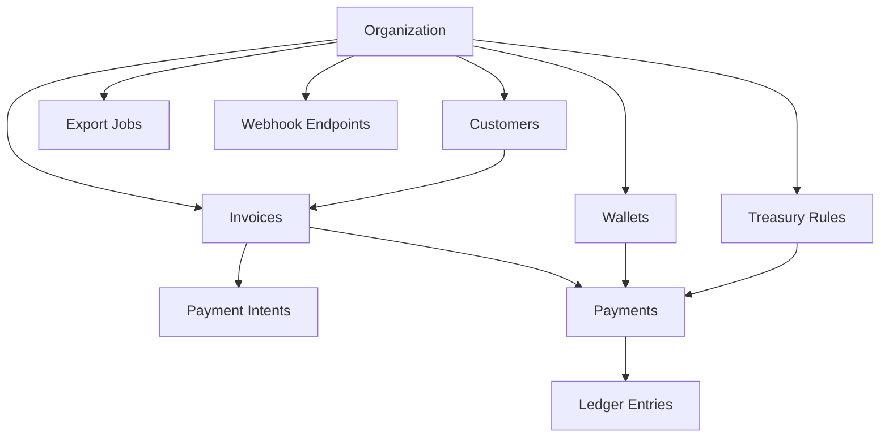

# Stablebooks Information Architecture and Wireframe Spec

## Document status

- Version: `v0.1`
- Date: `2026-04-19`
- Product: `Stablebooks`
- Companion docs:
  - [arc_treasury_os_blueprint.md](/G:/bugbounty/Stablebooks/docs/product/arc_treasury_os_blueprint.md)
  - [arc_treasury_os_prd.md](/G:/bugbounty/Stablebooks/docs/product/arc_treasury_os_prd.md)

## Purpose

This document translates the PRD into a buildable product structure:

- information architecture,
- route map,
- navigation model,
- object hierarchy,
- wireframe-level screen specs,
- component requirements,
- key states,
- desktop and mobile behavior.

It is written to support:

- product design,
- frontend implementation,
- backend API planning,
- and later usability reviews with design partners.

## Experience principles

### 1. Finance-first clarity

Every screen should answer one of these questions quickly:

- what is owed,
- what was paid,
- where funds settled,
- what needs action,
- what can be exported.

### 2. Operational trust

The interface should feel auditable and calm, not speculative.

Design implications:

- prioritize tables, timelines, status badges, and references,
- surface tx hashes and timestamps where needed,
- minimize decorative crypto UI patterns,
- keep language business-oriented.

### 3. One canonical truth

Arc settlement finality is the canonical milestone for payment completion.

Design implications:

- "paid" means settled on Arc,
- "processing" means detected but not yet final,
- status language must be consistent everywhere.

### 4. Progressive complexity

MVP users should be able to perform the core loop without configuring advanced treasury logic.

Design implications:

- onboarding asks only for minimum required data,
- treasury rules are lightweight and optional,
- advanced controls live behind dedicated detail pages.

## Information architecture

## App surfaces

Stablebooks has two main product surfaces:

1. `Admin application`
2. `Hosted payer experience`

## Admin application map

### Primary navigation

- Dashboard
- Invoices
- Customers
- Treasury
- Exports
- Settings

### Secondary utility areas

- Search
- Notifications
- Organization switcher later
- Help and docs later
- User menu

### Hidden or contextual routes

- Create invoice
- Invoice detail
- Customer detail
- Payment detail
- Unmatched payments queue
- Treasury rule detail
- Webhook settings

## Route map

### Auth and onboarding routes

- `/signin`
- `/signup`
- `/onboarding/org`
- `/onboarding/wallets`

### Core application routes

- `/dashboard`
- `/invoices`
- `/invoices/new`
- `/invoices/:invoiceId`
- `/customers`
- `/customers/:customerId`
- `/treasury`
- `/treasury/rules/:ruleId`
- `/reconciliation/unmatched`
- `/payments/:paymentId`
- `/exports`
- `/settings/organization`
- `/settings/wallets`
- `/settings/webhooks`
- `/settings/team`

### Hosted payer routes

- `/pay/:publicInvoiceToken`
- `/pay/:publicInvoiceToken/processing`
- `/pay/:publicInvoiceToken/success`
- `/pay/:publicInvoiceToken/issue`

## Object architecture

### Core objects

- Organization
- Wallet
- Customer
- Invoice
- PaymentIntent
- Payment
- TreasuryRule
- LedgerEntry
- ExportJob
- WebhookEndpoint

### Primary object relationships

### Navigation hierarchy by object

- Organization-level views:
  - Dashboard
  - Treasury
  - Exports
  - Settings
- Invoice-level views:
  - Invoice list
  - Create invoice
  - Invoice detail
- Customer-level views:
  - Customer list
  - Customer detail
- Payment-level views:
  - Unmatched queue
  - Payment detail

## Navigation model

## Desktop navigation

Recommended layout:

- left sidebar for primary nav,
- top bar for page title, search, user actions,
- page body for content,
- right-side contextual drawer for secondary details where needed.

Sidebar items:

- Dashboard
- Invoices
- Customers
- Treasury
- Exports
- Settings

Top bar items:

- global search,
- "Create invoice" CTA,
- alerts icon,
- user menu.

## Mobile navigation

Recommended layout:

- top app bar with page title and overflow actions,
- bottom nav for top-level sections,
- full-screen overlays for filters and create flows,
- drawers replaced with stacked detail pages or sheets.

Bottom nav:

- Dashboard
- Invoices
- Treasury
- Exports
- More

`More` includes:

- Customers
- Settings
- Unmatched payments

## Global UI system

## Global components

These should be consistent across screens:

- Page header
- Primary CTA button
- Status badge
- Info card
- Data table
- Empty state panel
- Timeline list
- Filter bar
- Search input
- Side drawer or modal
- Toast notification
- Inline error callout
- Confirmation dialog

## Global status vocabulary

Invoice statuses:

- `draft`
- `open`
- `processing`
- `paid`
- `partial`
- `overpaid`
- `overdue`
- `canceled`

Payment statuses:

- `detected`
- `settling`
- `final`
- `failed`
- `unmatched`

Treasury states:

- `healthy`
- `attention needed`
- `rule inactive`
- `data delayed`

## Empty-state principles

Empty states should not just say "nothing here."

Each should include:

- what this area is for,
- first action to take,
- one sentence on why it matters.

## Wireframe notation

For each screen, the spec includes:

- purpose,
- user,
- route,
- layout,
- sections,
- primary actions,
- states,
- validation and errors,
- responsive behavior,
- data requirements,
- analytics events.

## Screen specs

## 1. Sign in

### Purpose

Allow returning users to access the admin application.

### Primary user

- Admin
- Member

### Route

- `/signin`

### Layout

Desktop:

- centered authentication card on a neutral background
- left optional brand panel later

Mobile:

- full-screen stacked form

### Sections

1. Product logo and wordmark
2. Heading: `Sign in`
3. Email field
4. Password field
5. Sign in button
6. Secondary link to sign up
7. Support/help text

### Primary actions

- Sign in
- Go to sign up

### States

- default
- loading
- invalid credentials
- account locked later

### Validation and errors

- invalid email format
- missing password
- generic auth failure

### Data requirements

- none before submit

### Analytics events

- `signin_started`
- `signin_submitted`
- `signin_succeeded`
- `signin_failed`

## 2. Sign up

### Purpose

Create a new user account and begin onboarding.

### Route

- `/signup`

### Layout

Same shell as sign in.

### Sections

1. Product logo
2. Heading: `Create account`
3. Name field
4. Email field
5. Password field
6. Terms acknowledgement
7. Create account button
8. Link to sign in

### Primary actions

- Create account

### States

- default
- loading
- duplicate email
- success redirect

### Analytics events

- `signup_started`
- `signup_submitted`
- `signup_succeeded`

## 3. Organization setup

### Purpose

Create the company profile that anchors all invoices, wallets, and exports.

### Route

- `/onboarding/org`

### Layout

Desktop:

- onboarding shell with progress indicator at top
- single-column form with summary sidebar later

Mobile:

- single-column stacked form

### Sections

1. Progress indicator: `Step 1 of 2`
2. Heading: `Set up your organization`
3. Organization name
4. Billing country
5. Base currency
6. Your role
7. Continue button

### Primary actions

- Continue to wallet setup

### States

- default
- validation error
- saving

### Validation and errors

- organization name required
- unsupported base currency warning if outside `USD`/`EUR`

### Data requirements

- supported countries
- supported base currencies

### Analytics events

- `onboarding_org_started`
- `organization_created`

## 4. Wallet setup

### Purpose

Register the Arc settlement wallet required to start invoicing.

### Route

- `/onboarding/wallets`

### Layout

Desktop:

- top progress bar
- left form column
- right explainer panel

Mobile:

- stacked sections

### Sections

1. Progress indicator: `Step 2 of 2`
2. Heading: `Add your Arc settlement wallet`
3. Wallet address input or connect wallet action
4. Wallet label input
5. Role selector
6. Chain selector, prefilled to Arc
7. "Set as default settlement wallet" toggle
8. Save wallet button
9. Continue to dashboard button

### Primary actions

- Add wallet
- Continue

### Secondary actions

- Skip for now only if product allows read-only mode later

### States

- empty
- address validation success
- duplicate wallet
- unsupported chain
- wallet saved

### Validation and errors

- invalid address
- duplicate within org
- no default settlement wallet configured

### Data requirements

- wallet validation service
- supported wallet roles

### Analytics events

- `wallet_setup_started`
- `wallet_added`
- `onboarding_completed`

## 5. Dashboard

### Purpose

Give the finance operator a single operational snapshot.

### Route

- `/dashboard`

### Layout

Desktop:

- page header
- KPI row
- two-column content area
- right rail optional for alerts

Mobile:

- top summary cards in horizontal scroll or stack
- full-width sections in priority order

### Page header

Left:

- Page title: `Dashboard`
- Current period label

Right:

- `Create invoice` primary CTA
- optional filter by period

### Sections

1. KPI cards
   - Open invoices
   - Paid this period
   - Unmatched payments
   - Treasury balance snapshot
2. Recent payments feed
3. Invoice aging summary
4. Reconciliation alerts panel
5. Treasury snapshot
6. Quick actions panel

### Primary actions

- Create invoice
- Review unmatched payments
- Open exports
- View treasury

### States

- first-run empty
- normal data
- partial data delay

### Empty state

Headline:

- `Create your first invoice`

Support copy:

- Explain that invoices become the source for payment tracking and reconciliation.

CTA:

- `Create invoice`

### Data requirements

- invoice counts by status
- recent payments
- unmatched payment count
- wallet balances

### Analytics events

- `dashboard_viewed`
- `dashboard_quick_action_clicked`

## 6. Invoice list

### Purpose

Provide a searchable, filterable list of all invoices.

### Route

- `/invoices`

### Layout

Desktop:

- page header
- filter/search row
- data table

Mobile:

- page header
- filter chip row
- card list instead of wide table

### Page header

Left:

- `Invoices`
- subtitle with count

Right:

- `Create invoice`

### Filters

- status
- customer
- due date range
- currency
- search by invoice id or reference

### Table columns

- Invoice ID
- Customer
- Amount
- Currency
- Status
- Due date
- Paid date
- Last updated

### Primary actions

- Create invoice
- Open invoice detail

### Row actions

- Copy link
- Export record later
- Cancel invoice if eligible

### States

- empty
- filtered empty
- loading
- error

### Data requirements

- paginated invoice list
- filter metadata

### Analytics events

- `invoice_list_viewed`
- `invoice_filter_applied`
- `invoice_detail_opened`

## 7. Create invoice

### Purpose

Allow the operator to create a new invoice with payment and settlement settings.

### Route

- `/invoices/new`

### Layout

Desktop:

- main form area on left
- live summary card on right

Mobile:

- stacked form
- sticky footer CTA

### Sections

1. Customer
   - customer selector
   - quick add customer
2. Invoice details
   - amount
   - denomination currency
   - due date
   - invoice id or auto-generated
3. Payment settings
   - accepted token set
   - settlement chain preview
   - invoice reference code preview
4. Notes
   - memo
   - internal note
5. Summary panel
   - customer
   - total
   - settlement destination
   - shareable link generated after publish

### Primary actions

- Save draft
- Publish invoice

### Secondary actions

- Cancel
- Create customer inline

### Validation and errors

- missing customer
- amount less than minimum
- invalid due date
- no default settlement wallet

### States

- pristine
- editing
- saving draft
- publishing
- published success

### Success behavior

After publish:

- show success toast,
- redirect to invoice detail,
- expose invoice link and copy action.

### Data requirements

- customer list
- wallet config
- accepted token config

### Analytics events

- `invoice_create_started`
- `invoice_saved_draft`
- `invoice_published`

## 8. Invoice detail

### Purpose

Show the canonical record of one invoice and all linked payment activity.

### Route

- `/invoices/:invoiceId`

### Layout

Desktop:

- page header
- top summary row
- two-column body

Mobile:

- stacked summary cards
- action menu in top bar

### Page header

Left:

- invoice id
- customer name
- status badge

Right:

- Copy invoice link
- More actions menu

### Sections

1. Invoice summary card
   - amount
   - denomination
   - due date
   - issue date
   - reference code
2. Payment status card
   - current invoice status
   - amount received
   - amount outstanding
3. Payment timeline
   - invoice created
   - payment detected
   - Arc settlement final
   - reconciliation completed
4. Payment details panel
   - token
   - payer
   - source tx
   - Arc tx
   - timestamps
5. Reconciliation result panel
   - exact / partial / overpaid / unmatched
   - notes
6. Customer panel
7. Activity log

### Primary actions

- Copy invoice link
- Open hosted page
- Open payment detail if exists

### Secondary actions

- Cancel invoice
- Mark note
- Export invoice record later

### States

- draft
- open
- processing
- paid
- partial
- overpaid
- overdue
- canceled

### Error and edge states

- invoice not found
- payment exists but settlement data delayed
- reconciliation failed and requires manual review

### Data requirements

- invoice record
- linked customer
- linked payments
- event timeline
- activity log

### Analytics events

- `invoice_detail_viewed`
- `invoice_link_copied`
- `hosted_invoice_opened`

## 9. Customer list

### Purpose

Manage customer records used during invoice creation and export.

### Route

- `/customers`

### Layout

Desktop:

- page header
- search/filter bar
- table

Mobile:

- searchable card list

### Sections

1. Header with `Add customer`
2. Search bar
3. Table or cards

### Table columns

- Customer name
- Email
- Base currency
- Open invoices
- Paid volume later

### Primary actions

- Add customer
- Open customer detail

### States

- empty
- filtered empty

### Analytics events

- `customer_list_viewed`
- `customer_created`

## 10. Customer detail

### Purpose

Provide context on a customer and their invoice/payment history.

### Route

- `/customers/:customerId`

### Layout

Desktop:

- summary panel top
- invoice history table below

Mobile:

- stacked details and list

### Sections

1. Customer summary
   - name
   - email
   - billing metadata
2. Recent invoices
3. Payment history snapshot
4. Notes

### Primary actions

- Create invoice for this customer
- Edit customer

### Data requirements

- customer record
- invoices by customer
- payment aggregates later

### Analytics events

- `customer_detail_viewed`

## 11. Treasury overview

### Purpose

Show where stablecoin balances sit and how receipts affect treasury.

### Route

- `/treasury`

### Layout

Desktop:

- page header
- KPI strip
- two-column body with balances and recent activity

Mobile:

- stacked cards and simplified tables

### Page header

Left:

- `Treasury`
- subtitle with settlement chain focus

Right:

- Add wallet
- Manage rules

### Sections

1. Treasury snapshot cards
   - total stablecoin balance
   - operating wallet balance
   - reserve wallet balance
   - recent inbound receipts
2. Wallet balances table
   - wallet label
   - role
   - chain
   - token balance
   - last updated
3. Recent settlements feed
4. Routing rules summary
5. Attention panel
   - inactive rule
   - data delayed
   - missing reserve wallet

### Primary actions

- Add wallet
- Open rule detail
- Open related payment/invoice

### States

- no wallets
- healthy
- attention needed
- delayed data

### Data requirements

- wallet balances
- recent settlement events
- rules summary

### Analytics events

- `treasury_viewed`
- `wallet_added_from_treasury`
- `rule_detail_opened`

## 12. Treasury rule detail

### Purpose

View and configure simple treasury routing rules for MVP.

### Route

- `/treasury/rules/:ruleId`

### Layout

Desktop:

- form on left
- rule preview and impact summary on right

Mobile:

- stacked form with sticky save bar

### Sections

1. Rule type selector
   - default destination
   - percentage split
   - sweep threshold placeholder
2. Rule configuration form
3. Preview panel
   - example of how a receipt is routed
4. Status panel
   - active or inactive
   - last edited

### Primary actions

- Save rule
- Disable rule

### Validation and errors

- split percentages do not add to 100
- destination wallet missing
- incompatible wallet role

### Analytics events

- `treasury_rule_created`
- `treasury_rule_updated`
- `treasury_rule_disabled`

## 13. Unmatched payments queue

### Purpose

Provide a dedicated workflow for manual reconciliation exceptions.

### Route

- `/reconciliation/unmatched`

### Layout

Desktop:

- header
- explanatory banner
- queue table
- detail drawer on row click

Mobile:

- filter chips
- card list
- full-screen detail page

### Sections

1. Summary banner
   - count of unmatched payments
   - why these need review
2. Filter row
   - date range
   - token
   - chain
   - amount range later
3. Queue table

### Table columns

- Detected at
- Amount
- Token
- Source chain
- Payer
- Suspected invoice
- Status

### Primary actions

- Match to invoice
- Ignore
- Open payment detail

### States

- empty healthy state
- populated queue
- loading

### Empty state

Headline:

- `No unmatched payments`

Support copy:

- Explain that exact invoice-linked payments are being reconciled automatically.

### Analytics events

- `unmatched_queue_viewed`
- `manual_match_started`
- `manual_match_completed`

## 14. Payment detail

### Purpose

Show raw and normalized payment information for audit and manual review.

### Route

- `/payments/:paymentId`

### Layout

Desktop:

- summary card top
- two-column detail below

Mobile:

- stacked cards

### Sections

1. Payment summary
   - status
   - amount
   - token
   - payer
2. Chain movement panel
   - source chain
   - source tx hash
   - Arc settlement tx hash
   - timestamps
3. Invoice linkage panel
   - linked invoice if any
   - reference parsing result
4. Event log
5. Manual actions

### Primary actions

- Match to invoice
- Copy tx hash
- Open linked invoice

### States

- final
- settling
- unmatched
- failed

### Analytics events

- `payment_detail_viewed`
- `payment_tx_copied`

## 15. Export center

### Purpose

Let operators generate accounting-friendly and operations-friendly exports.

### Route

- `/exports`

### Layout

Desktop:

- header
- export form card
- recent exports table later

Mobile:

- stacked form
- result cards

### Sections

1. Export form
   - date range
   - export type
   - status filter
   - customer filter
   - token filter
2. Export preview note
3. Latest generated exports later

### Primary actions

- Generate export

### States

- empty
- generating
- ready
- failed

### Validation and errors

- invalid date range
- export too large warning later

### Analytics events

- `export_started`
- `export_succeeded`
- `export_failed`

## 16. Organization settings

### Purpose

Manage company metadata and defaults.

### Route

- `/settings/organization`

### Sections

1. Organization profile
2. Base currency
3. Default invoice settings later

### Primary actions

- Save changes

## 17. Wallet settings

### Purpose

Manage treasury and settlement wallets after onboarding.

### Route

- `/settings/wallets`

### Layout

- wallet table
- add wallet button
- edit drawer

### Sections

1. Wallet list
2. Add wallet action
3. Role and default settings

### Primary actions

- Add wallet
- Edit wallet
- Set default
- Deactivate wallet later

### Analytics events

- `wallet_settings_viewed`
- `wallet_updated`

## 18. Webhook settings

### Purpose

Configure outbound notifications to customer systems.

### Route

- `/settings/webhooks`

### Layout

- configuration form
- test delivery panel
- delivery log table later

### Sections

1. Endpoint URL
2. Signing secret
3. Event type toggles
4. Test webhook button

### Primary actions

- Save webhook
- Send test

### States

- not configured
- configured
- test success
- test failed

### Analytics events

- `webhook_saved`
- `webhook_test_sent`

## 19. Team settings

### Purpose

Support lightweight pilot-stage collaboration.

### Route

- `/settings/team`

### Sections

1. Members list
2. Invite member
3. Role labels

### Primary actions

- Invite member
- Remove later

### Notes

Keep this minimal in MVP.

## 20. Hosted invoice payment page

### Purpose

Help the payer understand the invoice and complete payment with confidence.

### Route

- `/pay/:publicInvoiceToken`

### Layout

Desktop:

- centered payment card with lightweight brand header
- optional right-side invoice summary on wider screens

Mobile:

- full-width stacked payment sheet

### Sections

1. Business identity
   - company name
   - invoice id
2. Amount due
   - denomination currency
   - accepted token display
3. Payment method area
   - connect wallet CTA or manual payment instructions
4. Reference details
   - invoice reference code
5. Status panel
   - awaiting payment
   - payment detected
   - final confirmation
6. Support/help note

### Primary actions

- Connect wallet
- Pay now
- Copy payment reference
- Copy destination address if manual option is enabled

### States

- awaiting payment
- expired
- processing
- paid
- partial warning
- overpayment note

### Validation and errors

- wrong wallet network
- unsupported token
- invoice no longer payable

### Data requirements

- public invoice payload
- accepted token config
- public status endpoint

### Analytics events

- `hosted_invoice_viewed`
- `hosted_payment_started`
- `hosted_payment_submitted`

## 21. Payment processing state

### Purpose

Communicate that the payment is in-flight and then settling on Arc.

### Route

- `/pay/:publicInvoiceToken/processing`

### Layout

- centered progress state
- transaction summary panel

### Sections

1. Progress stepper
   - wallet confirmed
   - transaction submitted
   - payment detected
   - Arc settlement finalizing
2. Current status message
3. Tx hash and amount

### Primary actions

- View transaction
- Refresh status if needed

### States

- waiting wallet signature
- tx sent
- payment detected
- finalizing
- timeout/retry message

### Analytics events

- `hosted_processing_viewed`

## 22. Payment success page

### Purpose

Confirm successful final payment after Arc settlement is final.

### Route

- `/pay/:publicInvoiceToken/success`

### Layout

- centered confirmation card

### Sections

1. Success header
2. Invoice and payment summary
3. Tx hash
4. Timestamp
5. Optional return/contact action

### Primary actions

- Copy receipt details later
- Return to invoice summary if useful

### Analytics events

- `hosted_payment_succeeded`

## 23. Payment issue page

### Purpose

Help the payer understand and recover from payment problems.

### Route

- `/pay/:publicInvoiceToken/issue`

### Layout

- centered issue card

### Sections

1. Issue title
2. Human-readable explanation
3. Payment summary if relevant
4. Recommended next step
5. Support/help link

### Issue scenarios

- invoice expired
- unsupported token
- wrong amount
- payment still pending unusually long

### Primary actions

- Try again
- Return to invoice
- Contact support

### Analytics events

- `hosted_payment_issue_viewed`

## Cross-screen patterns

## Search behavior

MVP global search can be lightweight and limited to:

- invoice id
- customer name
- payment reference

Desktop:

- top-nav search input

Mobile:

- local list-level search first

## Filters

Filter design principles:

- filters open inline on desktop,
- filters open in a sheet on mobile,
- active filters always show as chips,
- one-click clear all.

## Tables vs cards

Desktop:

- use tables for invoices, customers, wallets, payments.

Mobile:

- convert tables to stacked cards,
- keep most important fields visible first,
- move secondary actions into overflow.

## Status badge design

Status badges should be visually distinct and semantically stable:

- draft: neutral
- open: blue
- processing: amber
- paid: green
- partial: amber
- overpaid: violet or dark accent
- overdue: red
- canceled: gray

Use the same badge language in all tables, headers, and timelines.

## Timeline pattern

Use a reusable timeline for:

- invoice history,
- payment lifecycle,
- webhook delivery history later,
- treasury routing history later.

Each timeline item should include:

- event label,
- timestamp,
- actor or source,
- optional tx hash or reference link.

## Responsive behavior summary

### Desktop

- sidebar navigation
- data-dense tables
- side-by-side layouts
- detail drawers where helpful

### Tablet

- sidebar may collapse
- top actions remain visible
- tables can horizontally scroll if needed

### Mobile

- bottom navigation
- stacked cards
- full-screen create/edit flows
- simplified filters and fewer columns

## Suggested component inventory

### Layout components

- `AppShell`
- `SidebarNav`
- `TopBar`
- `BottomNav`
- `PageHeader`
- `SectionCard`

### Finance components

- `StatusBadge`
- `MetricCard`
- `InvoiceTable`
- `PaymentTimeline`
- `WalletBalanceTable`
- `ReconciliationResultCard`
- `ExportForm`
- `RulePreviewCard`

### Hosted flow components

- `InvoiceSummaryCard`
- `PaymentMethodPanel`
- `ProcessingStepper`
- `PaymentReceiptCard`
- `IssueStateCard`

## Suggested data dependencies by screen

## Must-have APIs for first frontend pass

- `GET /me`
- `POST /organizations`
- `GET /wallets`
- `POST /wallets`
- `GET /customers`
- `POST /customers`
- `GET /invoices`
- `POST /invoices`
- `GET /invoices/:id`
- `GET /payments/:id`
- `GET /treasury/overview`
- `GET /reconciliation/unmatched`
- `POST /exports`
- `GET /public/invoices/:token`
- `GET /public/invoices/:token/status`

## Analytics instrumentation summary

Track these as a minimum:

- account creation
- onboarding completion
- wallet setup success
- first invoice created
- invoice link viewed
- hosted payment started
- hosted payment final
- dashboard viewed
- unmatched queue viewed
- export generated

## Wireframe priorities

If only a subset is designed first, prioritize these screens:

1. Dashboard
2. Invoice list
3. Create invoice
4. Invoice detail
5. Hosted invoice payment page
6. Payment processing state
7. Payment success page
8. Treasury overview
9. Unmatched payments queue
10. Export center

## Design handoff notes

The UI should feel like a finance tool, not a trading terminal.

Avoid:

- neon crypto aesthetics,
- over-animated cards,
- token-first language dominating the product.

Prefer:

- ledger-like clarity,
- strong table ergonomics,
- calm status signaling,
- referenceable information,
- crisp hierarchy around money, status, and actions.

## Build-ready sequence

### Phase A

- Auth
- Onboarding
- Dashboard shell
- Invoice list
- Create invoice

### Phase B

- Invoice detail
- Hosted invoice page
- Processing and success states

### Phase C

- Treasury overview
- Unmatched queue
- Payment detail
- Exports

### Phase D

- Settings pages
- Rule detail
- mobile polish

## Final build summary

The smallest coherent experience is:

1. User signs up.
2. User sets up organization and Arc wallet.
3. User creates invoice.
4. Customer pays via hosted page.
5. Payment settles on Arc.
6. Invoice detail shows final reconciled status.
7. Dashboard and exports reflect the payment.

Every wireframe and route should reinforce this loop.
