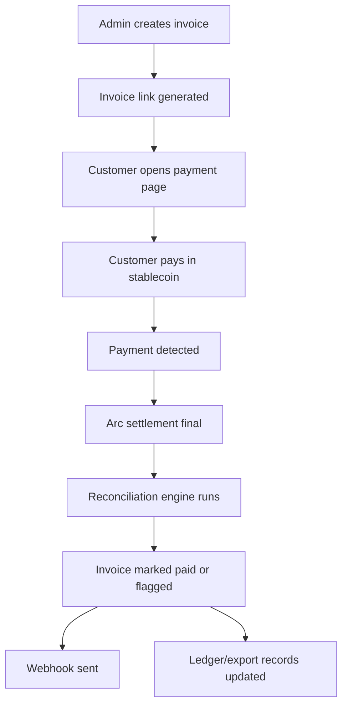
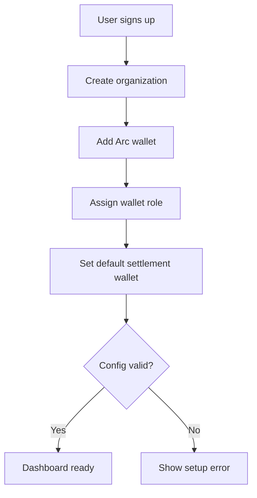
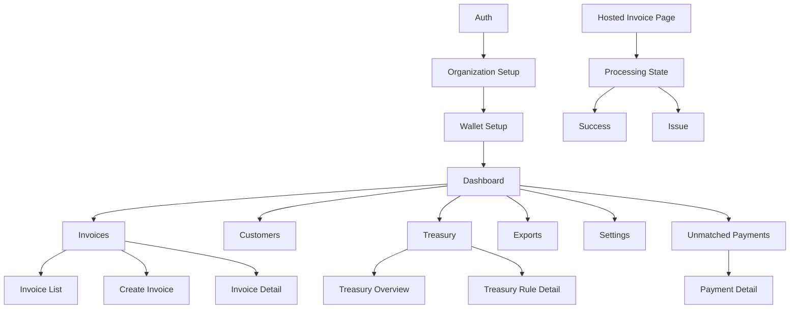

# Stablebooks PRD

## Document status

- Version: `v0.1`
- Date: `2026-04-19`
- Product: `Stablebooks`
- Working category: `Arc-native stablecoin receivables and treasury automation`
- Intended stage: `MVP -> design partner pilot`

## Product summary

Stablebooks helps B2B companies issue invoices, collect stablecoin payments, settle treasury balances on Arc, reconcile payments automatically, and export clean financial records without relying on spreadsheets and block explorers.

The product is designed around Arc's practical strengths:

- stablecoin-native gas economics,
- deterministic finality,
- treasury-centric settlement,
- future compatibility with Circle infrastructure.

This is not a general crypto checkout and not a retail wallet product. It is a finance operations product for teams that already have stablecoin payment volume or are ready to adopt it.

## Problem statement

Stablecoin-native businesses still run a large share of their finance operations manually:

- invoices are created in one tool,
- wallet addresses are shared manually,
- incoming payments are tracked in explorers,
- matching transfers to invoices is often manual,
- treasury balances are spread across chains,
- payouts and sweeps are handled ad hoc,
- accounting exports are assembled at month end.

This leads to:

- slow payment confirmation workflows,
- missed or unmatched transfers,
- operational errors,
- weak auditability,
- finance teams wasting time on repetitive work,
- poor visibility into cash and receivables.

## Vision

Make Arc the canonical settlement ledger for stablecoin-native B2B finance operations.

In the long run, Stablebooks should become the system of record for:

- receivables,
- treasury routing,
- payment reconciliation,
- payout operations,
- and later refunds, disputes, and reserve policies.

## Product goals

### Business goals

1. Acquire 3 to 5 design partners within the first release cycle.
2. Reach the first live customer processing inbound stablecoin invoices on Arc.
3. Validate willingness to pay for finance operations automation rather than commodity payment acceptance.
4. Build a repeatable pitch around stablecoin AR plus treasury workflow, not generic crypto payments.

### User goals

1. Create and send a stablecoin invoice in less than 3 minutes.
2. Know with confidence when an invoice is paid and final.
3. Reconcile 90%+ of invoice-linked payments automatically.
4. Reduce manual month-end finance work.
5. Keep treasury operations visible and rule-driven.

### Product goals

1. Treat Arc as the canonical final settlement layer.
2. Keep the smart contract surface area minimal in MVP.
3. Ship a usable product with one admin dashboard and one hosted payment flow.
4. Make every payment event auditable from invoice to settlement to export.

## Non-goals

The MVP will not include:

- fiat rails,
- lending or yield strategies,
- advanced accounting ERP replacement,
- payroll compliance,
- privacy-dependent workflows,
- generalized multi-chain wallet abstraction,
- consumer checkout optimization,
- institutional FX features.

## Target users

### Primary user

`Finance lead` or `founder-operator` at a stablecoin-friendly B2B company.

Responsibilities:

- create and track invoices,
- monitor treasury,
- confirm incoming payments,
- prepare exports for accounting,
- handle basic payout operations.

### Secondary users

- `Operations manager`
- `Treasury manager`
- `Controller` or external accountant
- `Customer payer`

## ICP

### Best initial ICP

Agencies and service firms with global clients and some willingness to accept stablecoins.

### Good signals

- already invoice in USD,
- clients are international,
- payment collection is slow or expensive via banks,
- stablecoins are already used informally,
- finance ops are lightweight and under-instrumented,
- the team values speed over heavy procurement.

### Secondary ICP

- web3-native SaaS companies,
- affiliate payout businesses,
- small marketplaces,
- remote service collectives,
- treasury-heavy crypto-native teams.

## User pain points

### Finance lead

- "I do not know which transfer corresponds to which invoice."
- "I cannot trust fast automation if the chain state is uncertain."
- "I have to check multiple wallets and chains every day."
- "I still export data manually and clean it in spreadsheets."

### Customer payer

- "I want one link and clear payment instructions."
- "I need confidence that payment was received."
- "I do not want back-and-forth over wallet addresses and memos."

### Accountant

- "I need a clean ledger and referenceable payment history."
- "I need consistency across invoice amount, token amount, tx hash, and settlement date."

## Value proposition

Stablebooks gives finance teams a single workflow for stablecoin receivables and treasury operations:

- create invoice,
- collect stablecoin,
- settle on Arc,
- reconcile automatically,
- apply treasury rules,
- export clean books.

## MVP scope

### In scope

1. Entity and wallet setup
2. Customer management
3. Invoice creation and hosted invoice links
4. Stablecoin payment collection
5. Arc-based final settlement tracking
6. Automatic invoice reconciliation
7. Payment status board
8. Basic treasury wallet view
9. CSV exports
10. Basic webhook notifications

### Out of scope for MVP

1. Refunds
2. Credit notes with full workflow engine
3. On-platform fiat conversion
4. Auto-FX between USDC and EURC
5. Role-based permissions beyond simple admin/member
6. Deep accounting integrations
7. Full payout batching UI
8. Multi-entity consolidation

## Core principles

1. Arc is the final settlement source of truth.
2. Business logic happens offchain first; contracts stay minimal.
3. Every important financial action has an audit trail.
4. UX must reduce manual reconciliation, not just move money.
5. The first release should feel trustworthy, not flashy.

## Functional requirements

## FR-1 Organization and wallet setup

The system must allow a company to:

- create an organization,
- connect or register treasury wallets,
- label wallets by role,
- choose a default settlement wallet on Arc.

Wallet roles:

- collection
- operating
- reserve
- payout

Acceptance criteria:

- an admin can add at least one Arc settlement wallet,
- the system stores role and chain metadata,
- the system prevents invoice activation without a valid settlement destination.

## FR-2 Customer management

The system must allow users to:

- create customers,
- store billing details,
- assign denomination currency,
- attach notes and metadata.

Acceptance criteria:

- customers can be referenced during invoice creation,
- customer records are searchable,
- metadata can be used later for exports and reconciliation.

## FR-3 Invoice creation

The system must allow users to create invoices with:

- invoice id,
- customer,
- amount,
- denomination currency,
- due date,
- memo,
- accepted payment tokens,
- payment reference code.

Acceptance criteria:

- every invoice gets a public invoice link,
- invoice status begins as `draft` or `open`,
- the system stores a canonical reference id for reconciliation.

## FR-4 Hosted payment experience

The system must provide a hosted payment page that shows:

- invoice amount,
- token options,
- destination instructions,
- invoice reference,
- live payment state.

Acceptance criteria:

- a payer can complete payment using a supported wallet,
- the page updates from `awaiting payment` to `processing` to `paid`,
- the payer sees final confirmation after Arc settlement is final.

## FR-5 Payment ingestion and settlement tracking

The system must:

- detect incoming payment transactions,
- associate them with invoice reference data,
- track source chain and settlement chain,
- store tx hashes and timestamps,
- update payment state based on Arc finality.

Acceptance criteria:

- payment records store both source and Arc settlement details when relevant,
- business webhooks are not emitted before final settlement,
- duplicate event processing is prevented.

## FR-6 Reconciliation

The system must:

- auto-match exact payments to invoices,
- handle partial payments,
- handle overpayments,
- flag unmatched transfers,
- allow manual review.

Acceptance criteria:

- exact matches are reconciled without operator input,
- partial and overpayments are visible in the invoice detail page,
- unmatched payments appear in a dedicated review queue.

## FR-7 Treasury overview

The system must show:

- balances by wallet,
- recent inbound receipts,
- payment settlement history,
- simple treasury routing status.

Acceptance criteria:

- finance users can see balances by role,
- users can filter by token and chain,
- recent treasury-affecting events are visible in time order.

## FR-8 Exports

The system must support:

- generic CSV export,
- accounting-friendly CSV export,
- invoice and payment history export.

Acceptance criteria:

- exports include invoice ids, customer refs, tx hashes, token, amount, and timestamps,
- exports can be filtered by date range,
- exports are generated deterministically from stored ledger/payment records.

## FR-9 Webhooks

The system must support webhooks for:

- invoice created,
- payment detected,
- payment finalized,
- invoice paid,
- payment unmatched.

Acceptance criteria:

- webhook deliveries are logged,
- retries are supported,
- payloads include stable event ids.

## FR-10 Basic treasury rules

The MVP must support limited treasury rules:

- default operating wallet assignment,
- simple receipt split by percentage,
- optional sweep threshold definition for later automation visibility.

Acceptance criteria:

- a user can configure a default receipt destination,
- a user can define a split rule,
- a user can view configured rules even if some execution remains manual in MVP.

## Non-functional requirements

## NFR-1 Trust and auditability

- All invoice, payment, and export actions must be logged.
- Every payment must link to its invoice and relevant tx hashes when possible.
- State transitions must be recorded with timestamps.

## NFR-2 Reliability

- Event ingestion must be idempotent.
- Queue-based background processing must handle retries safely.
- Payment state must not oscillate after finalization.

## NFR-3 Performance

- Dashboard pages should load core data in under 2 seconds for small to medium tenants.
- Hosted invoice links should render in under 2 seconds under normal load.
- Payment status updates should appear quickly after detection and finality.

## NFR-4 Security

- Secrets must not be exposed client-side.
- Admin actions must require authenticated sessions.
- Webhook signing must be supported.
- Smart contract scope must be minimized.

## NFR-5 Extensibility

- New tokens, chains, and export formats should be addable without redesigning core entities.
- Reconciliation logic must support future refund and dispute states.

## Success metrics

### Activation

- `% of signed-up orgs that create first invoice within 24 hours`
- `% of orgs that connect Arc settlement wallet during onboarding`

### Usage

- `number of invoices created per org per month`
- `number of paid invoices per org per month`
- `stablecoin volume processed`

### Product effectiveness

- `% of payments auto-reconciled`
- `median time from payment detection to final paid status`
- `median time saved in finance operations as reported by pilot users`

### Commercial

- `design partner conversion rate`
- `paid conversion rate`
- `monthly recurring revenue`

## Risks and constraints

1. Arc ecosystem maturity is still evolving, so some flows must remain modular.
2. Stablecoin treasury workflows can edge toward regulated behavior if the product becomes custodial.
3. Customers may ask for fiat or accounting integrations too early.
4. If crosschain settlement is added too early, product complexity can spike.

Mitigation:

- start with customer-controlled wallets,
- keep treasury logic transparent,
- delay high-complexity features,
- focus first on Arc-native collection and reconciliation.

## Assumptions

1. Arc is available as the canonical settlement chain for MVP deployment or pilot.
2. Early customers are willing to accept a stablecoin-first workflow.
3. A hosted payment flow is acceptable for initial customer acquisition.
4. Manual back-office support by the founder is acceptable during design partner phase.

## User flows

## Flow 1: Admin onboarding and wallet setup

### Goal

Get the organization ready to create invoices and receive settlement on Arc.

### Steps

1. Admin signs up.
2. Admin creates organization profile.
3. Admin adds or connects at least one Arc wallet.
4. Admin assigns wallet role as `operating` or `collection`.
5. Admin chooses default Arc settlement wallet.
6. System validates configuration.
7. Admin lands on empty-state dashboard.

### Edge cases

- wallet address invalid,
- duplicate wallet entered,
- settlement wallet missing,
- unsupported token or chain config attempted.

### Success condition

Organization is marked `ready_for_invoicing`.

## Flow 2: Create and send invoice

### Goal

Allow the finance lead to create a billable record and send a hosted payment link.

### Steps

1. User opens `Invoices`.
2. User clicks `Create invoice`.
3. User selects or creates customer.
4. User enters amount, currency, due date, memo, and accepted token set.
5. System generates invoice id and reference code.
6. User reviews and publishes invoice.
7. System creates public payment page.
8. User copies link or sends it by email manually.

### Edge cases

- customer missing email,
- duplicate internal reference,
- unsupported denomination requested,
- invoice created without valid Arc settlement destination.

### Success condition

Invoice status becomes `open` and public link is usable.

## Flow 3: Customer payment on hosted invoice page

### Goal

Let the payer complete invoice payment clearly and with confidence.

### Steps

1. Customer opens invoice link.
2. Customer sees invoice summary and payment instructions.
3. Customer connects wallet or copies destination details.
4. Customer submits payment.
5. System detects payment transaction.
6. Payment page moves to `processing`.
7. Arc settlement reaches finality.
8. Page updates to `paid`.
9. Customer can view receipt confirmation.

### Edge cases

- payment sent with wrong amount,
- unsupported token used,
- payment submitted after invoice expiry,
- tx detected but not yet settled on Arc,
- duplicate payment attempt.

### Success condition

Invoice is marked paid or partial/overpaid with clear status shown.

## Flow 4: Finance lead reviews payment and reconciliation

### Goal

Show the operator that the payment is reconciled correctly and auditable.

### Steps

1. Finance lead receives webhook or sees dashboard update.
2. User opens invoice detail page.
3. User reviews payment amount, token, payer address, tx hash, settlement timestamp.
4. System shows reconciliation outcome:
   - exact,
   - partial,
   - overpaid,
   - unmatched.
5. If exact, invoice auto-closes.
6. If non-exact, user resolves via manual review action.

### Edge cases

- multiple payments against one invoice,
- payment with stale reference,
- customer pays in several chunks,
- same wallet pays multiple invoices rapidly.

### Success condition

Invoice and payment records are in a consistent final state.

## Flow 5: Treasury operator reviews balances and routes receipts

### Goal

Give a simple operational view of how inbound receipts affect treasury.

### Steps

1. User opens `Treasury`.
2. User sees wallet balances and recent settlements.
3. User reviews default routing and any split rules.
4. User sees if receipt landed in operating wallet or requires manual action.
5. User exports or records treasury state if needed.

### Edge cases

- wallet balance mismatch due to delayed indexing,
- split rule misconfiguration,
- unsupported destination wallet role.

### Success condition

Operator understands where the money settled and what action is next.

## Flow 6: Export for accounting

### Goal

Let finance or accounting download reliable records for a chosen period.

### Steps

1. User opens `Exports`.
2. User chooses date range and export format.
3. User optionally filters by customer, token, or status.
4. System generates export.
5. User downloads file.
6. User uses file for bookkeeping or external accountant handoff.

### Edge cases

- empty export result,
- large export takes longer and should run async later,
- changed invoice state after export generation.

### Success condition

Export is internally consistent and maps invoice/payment/settlement data correctly.

## User flow diagrams

### Invoice to payment lifecycle

### Onboarding lifecycle

## Screen map

## Information architecture

The MVP application has two surfaces:

1. `Admin app`
2. `Hosted payer flow`

### Admin app navigation

- Dashboard
- Invoices
- Customers
- Treasury
- Exports
- Settings

### Hosted payer flow

- Invoice payment page
- Payment processing page
- Payment success page
- Payment issue page

## Screen inventory

## 1. Auth and onboarding

### 1.1 Sign in / sign up

Purpose:

- enter product,
- create account,
- access organization.

Primary actions:

- sign up,
- sign in,
- join invited organization later.

Key states:

- default,
- invalid credentials,
- loading,
- success redirect.

### 1.2 Organization setup

Purpose:

- create org profile and prepare first-use context.

Fields:

- organization name,
- billing country,
- base currency,
- team role.

Primary actions:

- create organization,
- continue to wallet setup.

### 1.3 Wallet setup

Purpose:

- connect or register Arc settlement wallet.

Fields:

- wallet address,
- label,
- role,
- chain.

Primary actions:

- add wallet,
- set default settlement wallet,
- continue to dashboard.

Key states:

- empty,
- wallet validation error,
- duplicate wallet,
- success.

## 2. Dashboard

### 2.1 Main dashboard

Purpose:

- give an immediate finance operations snapshot.

Key modules:

- total open invoices,
- paid volume this period,
- recent payments,
- treasury balances,
- reconciliation alerts,
- quick actions.

Primary actions:

- create invoice,
- view unmatched payments,
- open exports,
- go to treasury.

Key states:

- first-run empty state,
- normal data state,
- partial outage or indexing delay notice.

## 3. Invoices

### 3.1 Invoice list

Purpose:

- browse and manage all invoices.

Columns:

- invoice id,
- customer,
- amount,
- status,
- due date,
- paid date,
- token summary.

Primary actions:

- create invoice,
- search,
- filter,
- open invoice detail.

Key states:

- empty,
- filtered empty,
- pagination later,
- loading.

### 3.2 Create invoice

Purpose:

- create new receivable.

Sections:

- customer,
- amount and currency,
- due date,
- memo,
- accepted tokens,
- internal reference,
- settlement preview.

Primary actions:

- save draft,
- publish invoice.

Validation states:

- missing customer,
- invalid amount,
- due date invalid,
- no settlement wallet configured.

### 3.3 Invoice detail

Purpose:

- inspect one invoice and all related payment activity.

Modules:

- invoice summary,
- customer details,
- payment status,
- tx timeline,
- reconciliation result,
- public link,
- activity log.

Primary actions:

- copy invoice link,
- mark canceled,
- export invoice record,
- open manual review if needed.

Key states:

- draft,
- open,
- processing,
- paid,
- partial,
- overpaid,
- overdue,
- canceled.

## 4. Customers

### 4.1 Customer list

Purpose:

- manage billable entities.

Primary actions:

- add customer,
- search,
- open customer detail.

### 4.2 Customer detail

Purpose:

- view customer profile and invoice history.

Modules:

- billing details,
- recent invoices,
- payment history,
- notes.

## 5. Treasury

### 5.1 Treasury overview

Purpose:

- show wallet balances and recent settlement activity.

Modules:

- balances by wallet role,
- balances by token,
- recent settlements,
- receipt routing summary,
- configured rules snapshot.

Primary actions:

- add wallet,
- edit routing,
- inspect settlement.

Key states:

- no wallets configured,
- healthy,
- action required,
- delayed data notice.

### 5.2 Treasury rule detail

Purpose:

- view and configure simple receipt routing rules.

MVP rule types:

- default destination wallet,
- percentage split,
- future sweep threshold placeholder.

Primary actions:

- create rule,
- edit rule,
- disable rule.

## 6. Reconciliation and alerts

### 6.1 Unmatched payments queue

Purpose:

- triage payments that did not map cleanly to invoices.

Columns:

- detected at,
- amount,
- token,
- payer,
- source chain,
- suspected invoice,
- status.

Primary actions:

- match to invoice,
- mark ignored,
- flag for follow-up.

### 6.2 Payment detail drawer or page

Purpose:

- inspect raw and normalized payment information.

Modules:

- source tx,
- Arc settlement tx,
- payer address,
- reference parsing,
- reconciliation notes,
- event log.

## 7. Exports

### 7.1 Export center

Purpose:

- let users generate operational and accounting exports.

Controls:

- date range,
- export type,
- status filter,
- customer filter,
- token filter.

Primary actions:

- generate export,
- download latest,
- view export history later.

Key states:

- no exports yet,
- generating,
- ready,
- failed.

## 8. Settings

### 8.1 Organization settings

Purpose:

- configure organization metadata.

### 8.2 Wallet settings

Purpose:

- manage settlement and treasury wallets.

### 8.3 Webhook settings

Purpose:

- configure destination URL and secret.

### 8.4 Team settings

Purpose:

- basic admin/member management for pilot stage.

## 9. Hosted payer flow

### 9.1 Invoice payment page

Purpose:

- help the payer understand what to pay and how.

Modules:

- invoice header,
- business name,
- amount due,
- accepted tokens,
- wallet/payment action,
- payment status panel,
- help text.

Primary actions:

- connect wallet,
- pay now,
- copy invoice reference.

States:

- awaiting payment,
- expired,
- underpaid warning,
- overpayment note.

### 9.2 Payment processing page or modal state

Purpose:

- communicate that payment is detected and settlement is being finalized.

States:

- wallet confirmation pending,
- tx submitted,
- payment detected,
- Arc finalizing.

### 9.3 Payment success page

Purpose:

- confirm completion and provide receipt details.

Modules:

- success state,
- invoice id,
- amount paid,
- tx hash,
- payment timestamp,
- optional receipt download later.

### 9.4 Payment issue page

Purpose:

- explain payment problems and how to recover.

Scenarios:

- wrong amount,
- unsupported token,
- expired invoice,
- payment pending too long.

## Screen map diagram

## Prioritized backlog for design and engineering

## P0

1. Sign up and organization setup
2. Wallet setup
3. Invoice list
4. Create invoice
5. Hosted invoice page
6. Payment detection pipeline
7. Invoice detail with payment timeline
8. Dashboard summary
9. CSV export

## P1

1. Treasury overview
2. Unmatched payments queue
3. Webhook settings
4. Basic split rule configuration
5. Customer detail page

## P2

1. Team settings
2. Export history
3. Receipt download
4. Sweep thresholds
5. Manual routing actions

## Open product questions

1. Should MVP support both `USDC` and `EURC` at launch or start with `USDC` only?
2. Should public invoice links support direct wallet interaction first, manual send instructions first, or both?
3. Should crosschain payment collection be in MVP or immediately after MVP?
4. How much manual ops support is acceptable during the design partner phase?
5. What minimum accounting export format is required to close the first customer?

## Recommended decisions for now

1. Launch with `USDC` first and keep `EURC` as a fast follow unless a design partner strongly requires it.
2. Support both wallet-connect payment and copy instructions where feasible, but optimize the flow around direct payment.
3. Keep crosschain settlement just outside MVP unless it is essential to close a pilot customer.
4. Accept manual founder support during the pilot stage.
5. Start with one clean generic CSV and one accountant-oriented CSV.

## Build-ready summary

The MVP should feel like one coherent loop:

1. The admin sets up Arc settlement.
2. The admin creates an invoice.
3. The customer pays through a hosted link.
4. The system waits for Arc finality.
5. The invoice reconciles automatically.
6. The finance team sees the payment, treasury impact, and exportable record.

If that loop is reliable and fast, the product already creates real value.
